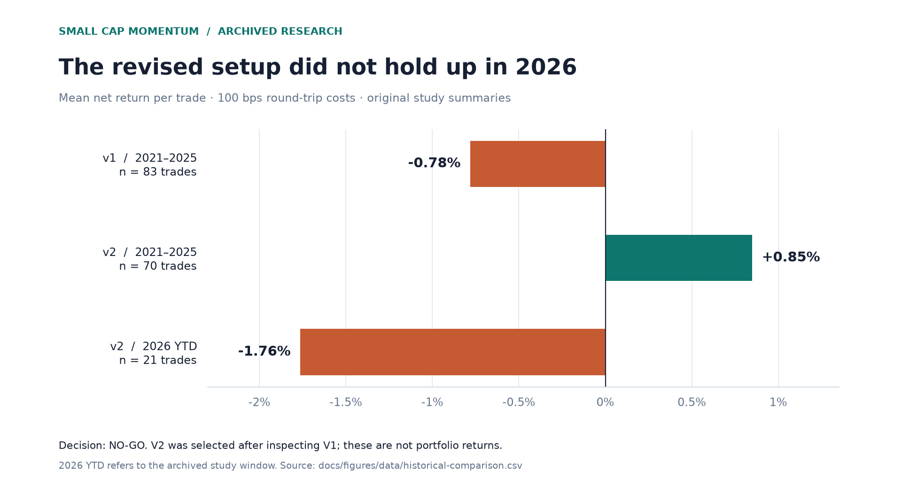
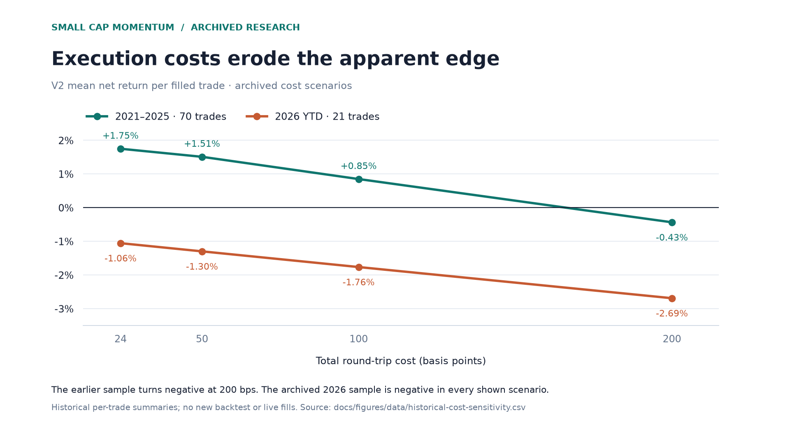

# Small cap momentum

**A Python research workbench for testing small-cap momentum ideas — including when the evidence says to stop.**

[](https://github.com/DavideWasTaken/Small-cap-momentum/actions/workflows/check.yml)

This project formalizes an intraday setup: a recent price and volume spike, consolidation, breakout, and the first pullback that holds. It turns that idea into explicit rules, simulated trades, cost stress tests, and a documented go/no-go decision.

**Research status: the studied intraday variants did not justify live deployment.** The value of the project is the reproducible logic and the investigation, not a claim of profitable trading.



*Original study summaries at 100 bps round-trip costs. V2 was selected after reviewing V1. These are historical per-trade results, not portfolio returns or a newly reproduced backtest. [Data and provenance](docs/figures/README.md).*

```text
Market data → Causal setup rules → Entry / stop / exit simulation
                                         ↓
                         Cost stress → Validation → Research decision
```

## What is inside

- A configurable 15-minute signal engine with automatic resistance detection.
- Yahoo Finance, Alpaca, and Polygon market-data adapters; no broker order submission.
- Fixed-target, trailing-stop, and end-of-day exits, with pessimistic stop-first handling when stop and target occur in the same bar.
- Cost and execution-delay sensitivity, bootstrap checks, and comparisons across years.
- A cash-constrained portfolio accounting layer that reserves capital for open positions.
- A separate monthly momentum study using academic portfolio returns and ETF benchmarks.

## Quick start

Requires **Python 3.11+**. From your terminal:

```bash
git clone https://github.com/DavideWasTaken/Small-cap-momentum.git
cd Small-cap-momentum
python -m venv .venv
```

Activate the environment with `source .venv/bin/activate` on macOS/Linux or `.venv\Scripts\Activate.ps1` in Windows PowerShell, then:

```bash
python -m pip install -e ".[dev]"
python -m pytest -q
smallcap-bt --help
```

The test suite uses synthetic data and needs no API credentials. A current-data experiment using Yahoo Finance is:

```bash
smallcap-bt backtest --config configs/default.yaml --tickers-file configs/tickers.txt
```

This downloads recent data, requires network access, and may produce no signals. Historical examples such as CLRO use dated observations and require the corresponding historical bars; today's downloads do not recreate them automatically.

## What the original study found

The archived v1 study recorded **83 trades**, a **0.74 profit factor**, and **−0.78% average return per trade** at 100 bps round-trip costs. The revised v2 improved the earlier sample but weakened in 2026, and its bootstrap interval still included zero. The recorded decision was **no-go**.

These are historical trade-level summaries, not newly reproduced portfolio returns. The public release includes selected aggregate tables and their figures; provider datasets, full generated reports and notebook output remain excluded. Reproducing the historical numbers requires the original data snapshots or a documented replacement and the appropriate data access.



The earlier V2 sample turns negative at 200 bps. The archived 2026 sample is negative at every cost level shown. The `2026 YTD` label refers to the original study window, not a continuously updated result.

Both charts can be [regenerated offline](docs/figures/README.md#regenerate-offline) from the bundled aggregate CSVs.

Start with [the final research decision](VERDETTO_FINALE.md), [the frozen v1 specification](FROZEN_SPEC_V1.md), or [the archived research notes](RESEARCH_NOTES.md). The detailed research notes are in Italian.

## Reading the portfolio output

Entry sizing is constrained by available cash, the risk budget, and the per-trade allocation cap. Entry commissions are reserved, and cash is released at exit. Entries sharing a bar with an exit cannot reuse that exit's proceeds; simultaneous entries use deterministic ticker order.

`executed_trades` and `skipped_for_capital` describe the cash simulation. `trades`, win rate, profit factor, and expectancy describe all independently simulated signals. Fractional shares are allowed. Open positions are held at cost, so the equity curve and its drawdown reflect **realized P&L**, not intraday mark-to-market risk. This accounting correction does not turn the historical strategy into a validated investment process.

## Research boundaries

- The original intraday universe used current IWM holdings, creating survivorship bias. It is not a historical point-in-time universe.
- Bar data cannot model the exact order of intrabar prices, halts, partial fills, spread changes, or market impact.
- Signals enter after the confirming bar. Resistance uses sessions before the trigger session; manual level overrides are reserved for known test cases.
- Historical studies and report templates contain run-specific assumptions. Read [scripts/README.md](scripts/README.md) before regenerating reports.
- The monthly study uses aggregate academic portfolios, not a constituent-level execution ledger. Its cost estimates are scenarios.
- No tests or historical summaries establish future investment performance.

## Project structure

| Path | Purpose |
| --- | --- |
| `src/smallcap_bt/` | Data adapters, signal rules, execution simulation, accounting, CLI |
| `configs/` | Experiment settings and frozen research specifications |
| `tests/` | Offline regression tests |
| `scripts/` | Data preparation, research validation, and historical report builders |
| `notebooks/` | Research notebooks, with saved outputs cleared |

## License

The source code is available under the [MIT License](LICENSE). Third-party market data and models retain their own terms and are not licensed by this repository.
